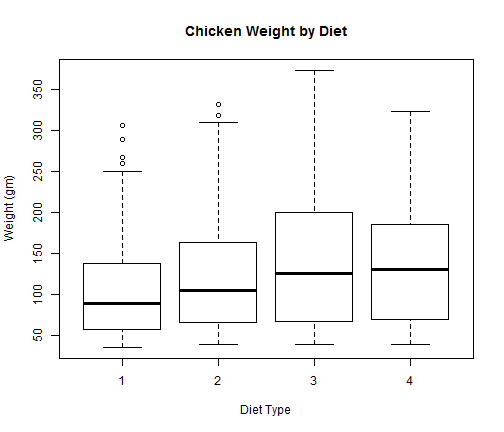
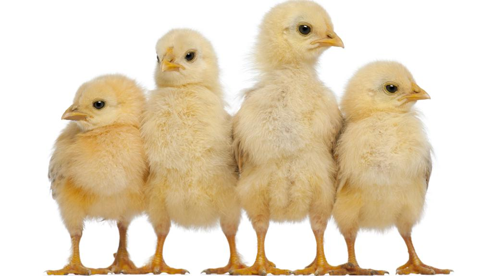

## Motivation

1. Global poultry meat output is expected to amount to 106.4 million tonnes in 2013, according to a forecast made by the Food and Agriculture Organisation (FAO). 
2. Chicken meat output accounts for some 88 per cent of world poultry meat production.
3. A broiler chicken is a chicken raised specifically to be eaten. Broiler chickens grow faster than other types of chicken and are often a cross between white Cornish and white Plymouth Rock birds. 
4. Broiler chickens have a relatively short life span, with most birds being marketed between four and 10 weeks of age. 
5. Putting weight on broiler chickens is thus critical to fetch optimal market price.

---

## Data

1. The ChickWeight data contains 578 rows and 4 columns from an experiment on the effect of diet on early growth of chicks.
2. The variables are:
   * weight - body weight of the chick (gm)
   * Time - number of days since birth when the measurement was made
   * Chick - unique identifier for the chick
   * Diet - experimental diet the chick received

--- .class #id 

## Chicken Weight by Diet Type

The data shows that Diet 3 produces chickens that are heavier than other diets but it also produces chicken with more weight variations.

---

## Forecasting Weight of New Chicks

A farmer who adopts one of the four Diet types may wish to forecast the  expected weight of his chicken to check that the Diet is indeed producing the desired weight effect.

An application is written to forecast the weight of a chick where the user can specify the **Diet** type and the **Time** of growth.

[This application] (https://raymondau.shinyapps.io/Chicken/) uses a linear regression model to forecast the chick's expected weight.

